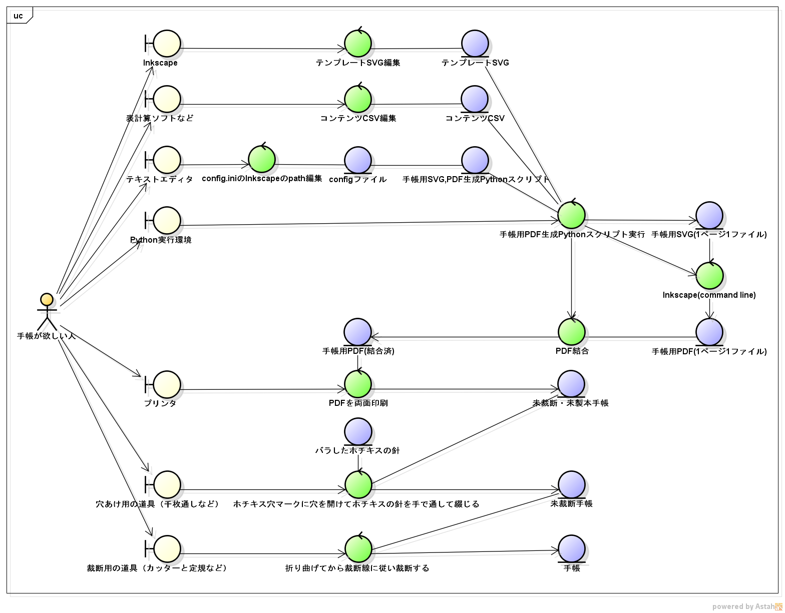

# myplannergen 0.02

SVGのテンプレートファイルとCSVのコンテンツファイルを使って手帳のPDFを作るソフトウェアです。

## ChangeLog
[CHANGELOG (2020.05.04, v0.02)](./CHANGELOG.md)

## 大まかな使い方
1. SVGで手帳の原型(テンプレート)を作る
1. CSVで中身(何年・何月・何日・何曜日・何の日・何色...など)を作る
1. Pythonスクリプトで，SVGテンプレートの中身をCSVに従って置換し，中綴じを考慮したページ割り付けの手帳用PDFを作る
1. PDFを両面印刷して中綴じ製本する

現状，SVGの形を変えたりCSVの中身を変えたりするのは容易ですが，まだPythonスクリプト内埋め込みの要素が多く柔軟性が足りません。

## 詳しい使い方
上のバウンダリから順に作業を行っていきます。

|  図中の名前  |  ファイル名 or ディレクトリ名  |
| ---- | ---- |
|  テンプレートSVG  |  [template.svg](template.svg), [template_cutline.svg](template_cutline.svg)  |
|  コンテンツCSV  |  [contents.csv](contents.csv)  |
|  手帳用SVG,PDF生成Pythonスクリプト  |  [planner_svg_gen.py](planner_svg_gen.py)  |
|  手帳用SVG(1ページ1ファイル)  |  [export_svg/](export_svg)  |
|  手帳用PDF(1ページ1ファイル)  |  [export_pdf/](export_pdf)  |
|  手帳用PDF(結合済)  |  [output.pdf](output.pdf)  |

## Requirement
* Python3 (3.8.2 でのみ動作確認), PyPDF2, Win10 & Inkscape

## SVGに関する解説
SVG内の各パーツのIDに，以下のような名前を振っています。
Pythonスクリプトは，このIDを用いてSVG内の文字の置換をしています。

裁断線は，少し大きめに引いてあります。大きめにしないと，裁断したときに内側のページの端が切れてしまいます。

## 印刷-製本に関する解説
印刷は以下のような設定で行いました。(EPSONのインクジェットプリンタの例)

片面を刷り終えたところで以下のようなダイアログが出たので指示通りに裏返して印刷しました。

印刷した結果は以下のようになります。

使えそうな中綴じホッチキスが見つけられなかったので，穴をあけて手でホチキス針を通すことにしました。

最後に裁断して完成です。折り曲げた後に裁断した方が良いです。
裁断した後に折り曲げた場合，真ん中のページが外にはみ出てしまいページめくりがやりにくくなります。

## License
本ソフトウェアは[MITライセンス](./LICENSE)の元提供されています。

## Acknowledgments
SVGをPDFに変換する方法について，以下のサイトを参考にしました。
[複数のsvgをまとめてpdfへ変換する - Inkscape&バッチファイル](http://rorokuusou.hatenablog.com/entry/2016/12/20/000348)

今回のSVGテンプレート作成にあたって，左右に日付があるホリゾンタルの構成として以下を参考にしました。
[MIDORI 月間＋月間ホリゾンタル](https://www.midori-store.net/diary2018/item/for_month_h.html)
