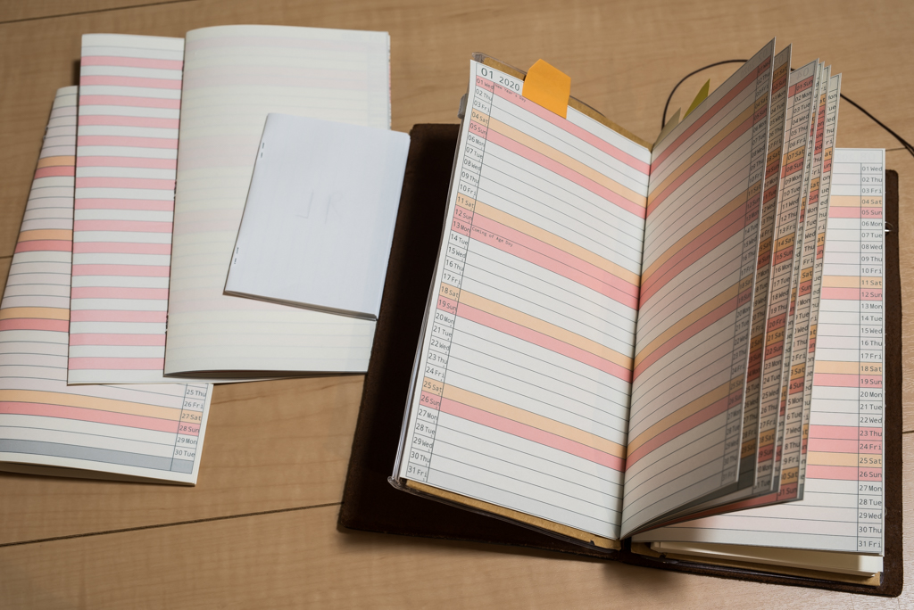
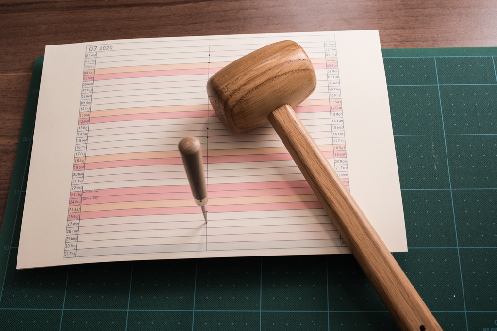

# myplannergen

2019年の師走，本屋さんを何店か回り...ネットを検索し...残念ながら自分が思い描く手帳が見つけられませんでした。ないものは自分で作るしかないという声が聞こえた気がしました。自分で作るのは楽しいですし，それを仕事で使うと嫌な予定の書き込みも楽しくなってしまうかもしれません。早速作りました。

試行錯誤の結果，まだ不満なところもありますが，ひとまず最初のプロトタイプとして自分の欲しかった手帳(トラベラーズノートのサイズに合った，見開き1ヵ月・ホリゾンタル)を手に入れることができました。同じ悩みを抱えている仲間のために，拙くて恐縮ですが手帳作成に用いたプログラムやテンプレート，制作のノウハウなどを展開します。役に立たなかったらごめんなさい。今後も改良していく予定です。もし改良したいという方がおりましたら歓迎します。

## アイディアの概要
1. SVGで手帳の原型(テンプレート)を作る
1. CSVで中身(何年・何月・何日・何曜日・何の日・何色...など)を作る
1. Pythonを用いて，SVGテンプレートの中身をCSVに従って置換し，中綴じを考慮したページ割り付けの手帳用SVGを作る
1. 手帳用SVGを両面印刷して中綴じ製本する

## 詳細な構成
"手帳が欲しい人"は，上のバウンダリから順に作業を行っていきます。

## 次の目標
* Python実行，バッチファイル実行，PDF結合をいちいちやらなくても良い様にする
* 他の人が作った手帳のデータを共有できるようにする

## SVGに関する解説
SVG内の各パーツのIDに，以下のような名前を振っています。
Pythonスクリプトは，このIDを用いてSVG内の文字の置換をしています。

裁断線は，少し大きめに引いてあります。大きめにしないと，裁断したときに内側のページの端が切れてしまいます。

## 印刷-製本に関する解説
印刷は以下のような設定で行いました。(EPSONのインクジェットプリンタの例)

片面を刷り終えたところで以下のようなダイアログが出たので指示通りに裏返して印刷しました。

印刷した結果は以下のようになります。

使えそうな中綴じホッチキスが見つけられなかったので，穴をあけて手でホチキス針を通すことにしました。

最後に裁断して完成です。折り曲げた後に裁断した方が良いです。
裁断した後に折り曲げた場合，真ん中のページが外にはみ出てしまいページめくりがやりにくくなります。

## License
本ソフトウェアは[MITライセンス](./LICENSE)の元提供されています。

## Acknowledgments
SVGをPDFに変換するバッチファイルについて，以下のサイトを参考にしました。
[複数のsvgをまとめてpdfへ変換する - Inkscape&バッチファイル](http://rorokuusou.hatenablog.com/entry/2016/12/20/000348)

今回のSVGテンプレート作成にあたって，左右に日付があるホリゾンタルの構成として以下を参考にしました。
[MIDORI 月間＋月間ホリゾンタル](https://www.midori-store.net/diary2018/item/for_month_h.html)
